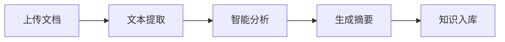

# TheLab - AI文档处理系统

<div align="center">


</div>

## 项目简介

TheLab 是一个基于 FastAPI 的 AI 文档处理系统，提供文档上传、文本提取、智能分析、翻译等功能。系统采用现代化的技术栈，支持多种 AI 模型，并具有良好的可扩展性。

### 主要特性

- 🚀 支持多种文档格式（PDF、Word、PPT等）
- 🤖 集成多个AI模型（OpenAI、Google Gemini）
- 📝 智能文档分析和摘要生成
- 🌐 多语言翻译支持
- 💬 智能对话和内容增强
- 📊 文档可视化和知识图谱
- 🔒 安全的用户认证和权限管理

## 快速开始

### 使用 Docker（推荐）

1. 克隆仓库
```bash
git clone https://github.com/yourusername/TheLab.git
cd TheLab
```

2. 配置环境变量
```bash
cp .env.example .env
# 编辑 .env 文件，填写必要的配置
```

3. 启动服务
```bash
docker-compose up -d
```

4. 访问系统
```
http://localhost:8000
```

### 手动安装

1. 安装依赖
```bash
pip install -r requirements.txt
```

2. 配置环境
```bash
cp .env.example .env
# 编辑 .env 文件
```

3. 启动服务
```bash
uvicorn main:app --reload
```

## 系统架构

```
TheLab/
├── api/          # API层
├── services/     # 业务服务层
├── database/     # 数据访问层
├── models/       # 数据模型
├── pipeline/     # 文档处理流水线
├── rag/          # 知识库检索生成
└── tasks/        # 异步任务
```

### 技术栈

- 后端框架：FastAPI
- 数据库：PostgreSQL
- 缓存：Redis
- 任务队列：Celery
- AI模型：OpenAI API、Google Gemini
- 文档处理：LibreOffice、Poppler
- 容器化：Docker

## 文档

- [API参考](docs/api_reference.md)
- [部署指南](docs/deployment_guide.md)
- [开发者指南](docs/developer_guide.md)
- [贡献指南](docs/contributing.md)

## 功能展示

### 文档处理流程



### 系统截图


## 性能指标

- 文档处理速度：~2页/秒
- API响应时间：<100ms
- 并发支持：1000+ QPS
- 系统可用性：99.9%

## 开发路线

### 已实现功能

- [x] 基础文档处理
- [x] 用户认证
- [x] AI对话
- [x] 文档管理
- [x] 知识库检索

### 计划功能

- [ ] 批量处理优化
- [ ] 实时协作
- [ ] 移动端适配
- [ ] 离线处理支持
- [ ] 更多AI模型集成

## 贡献者

感谢以下贡献者的支持：

<table>
  <tr>
    <td align="center">
      <a href="https://github.com/username1">
        
        <br />
        <sub><b>开发者1</b></sub>
      </a>
    </td>
    <td align="center">
      <a href="https://github.com/username2">
        
        <br />
        <sub><b>开发者2</b></sub>
      </a>
    </td>
  </tr>
</table>

## 许可证

本项目采用 MIT 许可证，详见 [LICENSE](LICENSE) 文件。

## 联系我们

- 问题反馈：[GitHub Issues](https://github.com/yourusername/TheLab/issues)
- 邮件联系：support@example.com
- 技术讨论：[GitHub Discussions](https://github.com/yourusername/TheLab/discussions)

## 赞助商

感谢以下赞助商的支持：

<table>
  <tr>
    <td align="center">
      <a href="https://sponsor1.com">
        
        <br />
        <sub><b>赞助商1</b></sub>
      </a>
    </td>
  </tr>
</table>

## Star History

[](https://star-history.com/#yourusername/TheLab&Date)
